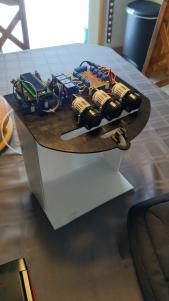

# Inebriator
Construct a machine that automatically dispenses pre-determined cocktails

# Components
- [perestalic pump](https://www.amazon.com/gp/product/B01IUVHB8E/ref=ppx_yo_dt_b_asin_title_o00_s00?ie=UTF8&psc=1)
    - Used to dispense a set amount of liquid

- [Silicon Tubing](https://www.amazon.com/gp/product/B01C3GCZTM/ref=ppx_yo_dt_b_asin_title_o00_s00?ie=UTF8&psc=1)
    - Used to direct the flow of liquids

- [Arduino Uno](https://www.amazon.com/Arduino-A000066-ARDUINO-UNO-R3/dp/B008GRTSV6/ref=sr_1_4?crid=2ULS3MO19KNJ2&keywords=arduino+uno&qid=1581355340&sprefix=ardui%2Caps%2C166&sr=8-4)
    - Brains of the inebriator.

- [Relay board]()
    - Relay board with 12v relays to operate the 12v pumps

- Custom routing board
    - Prototype board that allows input from the relay to the output of the pumps with diode which prevent flyback from dc pumps

- [Power Drop Down](https://www.amazon.com/gp/product/B07GTHK99K/ref=ppx_yo_dt_b_asin_title_o00_s00?ie=UTF8&psc=1)
    - Allows the 12v to be dropped down to 5v for the ardunio uno

# First Prototype

